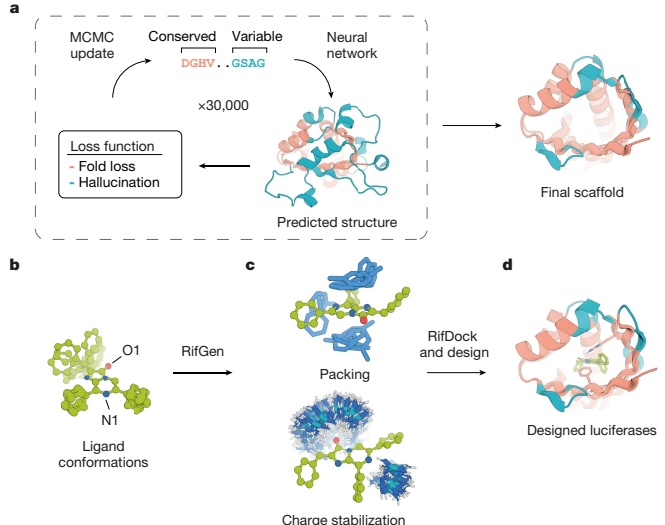
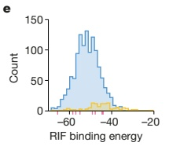
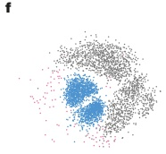
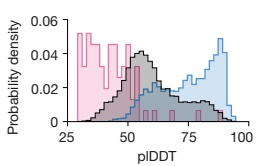

a

b

☐ Native small-molecule-binding proteins ☐ DL-optimized scaffolds

☐ Native NTF2-like proteins ☐ Energy-optimized scaffolds

Fig. 1 | Generation of idealized scaffolds and computational design of de novo luciferases. a, Family-wide hallucination. Sequences encoding proteins with the desired topology are optimized by Markov chain Monte Carlo (MCMC) sampling with a multicomponent loss function. Structurally conserved regions (peach) are evaluated on the basis of consistency with input residue–residue distance and orientation distributions obtained from 85 experimental structures of NTF2-like proteins, whereas variable non-ideal regions (teal) are evaluated on the basis of the confidence of predicted inter-residue geometries calculated as the KL divergence between network predictions and the background distribution. The sequence-space MCMC sampling incorporates both sequence changes and insertions and deletions (see Supplementary Methods) to guide the hallucinated sequence towards encoding structures with the desired folds. Hydrogen-bonding networks are incorporated into the designed structures to increase structural specificity. b–d, The design of luciferase active sites. b, Generation of luciferase

substrate (DTZ) conformers. c, Generation of a Rotamer Interaction Field (RIF) to stabilize anionic DTZ and form hydrophobic packing interactions. d, Docking of the RIF into the hallucinated scaffolds, and optimization of substrate–scaffold interactions using position-specific score matrices (PSSM)-biased sequence design. e, Selection of the NTF2 topology. The RIF was docked into 4,000 native small-molecule-binding proteins, excluding proteins that bind the luciferin substrate using more than five loop residues. Most of the top hits were from the NTF2-like protein superfamily (pink dashes). Using the family-wide hallucination scaffold generation protocol, we generated 1,615 scaffolds and found that these yielded better predicted RIF binding energies than the native proteins. f,g, Our DL-optimized scaffolds sample more within the space of the native structures (f) and have stronger sequence-to-structure relationships (more confident AlphaFold2 structure predictions) (g) than native or previous non-deep-learning energy-optimized scaffolds.

#### Family-wide hallucination

Native NTF2 structures have a range of pocket sizes and shapes but also contain features that are not ideal, such as long loops that compromise stability. To create large numbers of ideal NTF2-like structures, we developed a deep-learning-based 'family-wide hallucination' approach that integrates unconstrained de novo design $ ^{17,18} $ and Rosetta sequence-design approaches $ ^{19} $ to enable the generation of an essentially unlimited number of proteins that have a desired fold (Fig. 1a). The family-wide hallucination approach used the de novo sequence and structure discovery capability of unconstrained protein hallucination $ ^{17,18} $ for loop and variable regions, and structure-guided sequence optimization for core regions. We used the trRosetta structure prediction neural network $ ^{20} $, which is effective in identifying experimentally successful de-novo-designed proteins and hallucinating new globular proteins of diverse topologies. Starting from the sequences of 2,000 naturally occurring NTF2s, we carried out Monte Carlo searches in sequence space, at each step making a sequence change and predicting the structure using trRosetta. As the loss function guiding search, we used the confidence of the neural network in the predicted structure (as in our previous free hallucination study) supplemented with a topology-specific loss function over core residue pair geometries (see Supplementary Methods); in the loop regions, we also allowed the number of residues to vary.

