
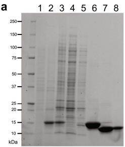

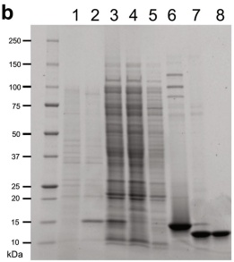

d

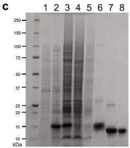

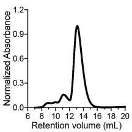

e

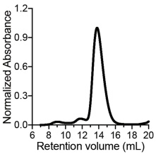

f

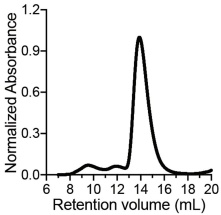

g

h

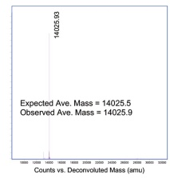

i

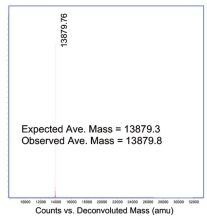

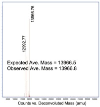

j

k

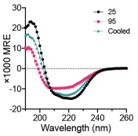

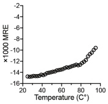

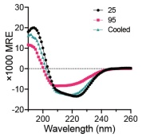

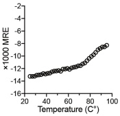

I

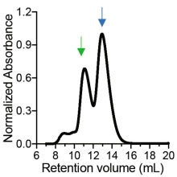

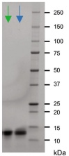

Extended Data Fig. 3 | Expression, purification and structural characterization of LuxSit variants. a–c, The recombinant expression of a, LuxSit, b, LuxSit-i, and c, LuxSit-fin E. coli. Annotations for each lane are the following – 1: Pre-IPTG; 2: Post-IPTG; 3: Soluble lysate; 4: Flow-through; 5: Wash; 6: Elusion; 7: Post-TEV cleavage; 8: Post-SEC. d–f, Size-exclusion chromatography of the purified d, LuxSit; e, LuxSit-i; and f, LuxSit-f monomer. g–i, Deconvoluted mass spectrum of g, LuxSit, h, LuxSit-i, and i, LuxSit-f. j, k, Far-ultraviolet circular

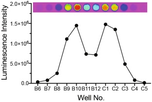

dichroism (CD) spectra (Left panel) of j, LuxSit-i; and k, LuxSit-f at 25 °C (black line), 95 °C (red line) and cooled back to 25 °C (green line). CD melting curve at 220 nm (Right panel). I, Dimeric SEC peak was observed when LuxSit-i was concentrated to a high concentration (~50 μM) in Tris pH 8.0 buffer. Both dimeric and monomeric SEC fractions showed the expected size on SDS–PAGE and both peaks were catalytically active to emit luminescence in the presence of 25 μM DTZ.

