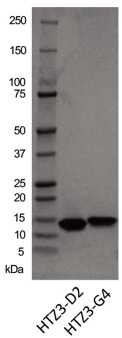
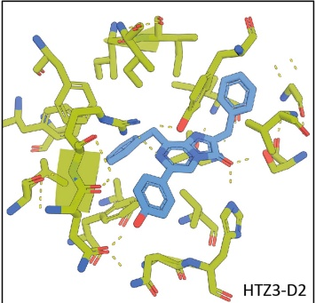
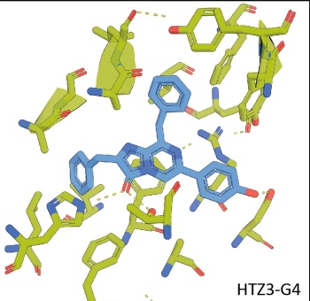
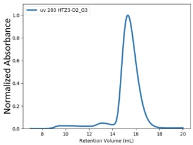
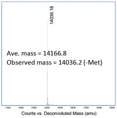
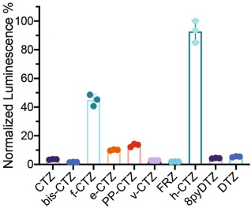
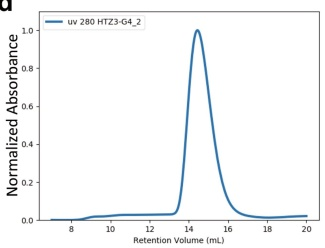
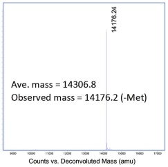
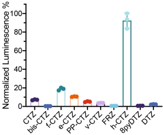
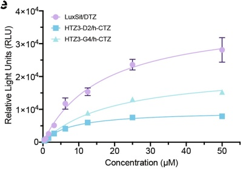

a

b

C

d

e

Extended Data Fig. 4 | Expression, purification and activity measurement of selected de-novo-designed luciferases for h-CTZ. a, Coomassie-stained SDS-PAGE of HTZ3-D2 and HTZ3-G4 purified from recombinant expression in E. coli. b, Magnified views of HTZ3-D2 (left panel) and HTZ3-G4 (right panel) illustrated the side-chain preorganization of luciferase-h-CTZ interactions. c, d, Size-exclusion chromatography (left), deconvoluted mass spectrum (middle), and the normalized luciferase activities on selected compounds

(right) of c, HTZ3-D2 and d, HTZ3-G4, which suggested high specificity for the design target substrate, h-CTZ. e, Substrate concentration dependence of LuxSit (w/ DTZ), HTZ3-D2 (w/ h-CTZ), and HTZ3-G4 (w/ h-CTZ) activity in PBS. All data points were fitted to the Michaelis-Menten equation. HTZ3-D2 and HTZ3-G4 showed  $ K_m $ values of 7.9 and 19.5  $ \mu $M with -25% and -58%  $ I_{\text{max}} $ of LuxSit, respectively. Data are presented as mean ± s.d. (n = 3).

