
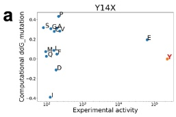

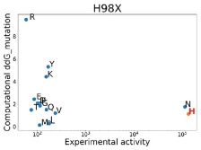

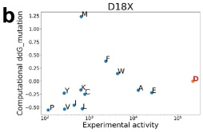

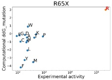

C

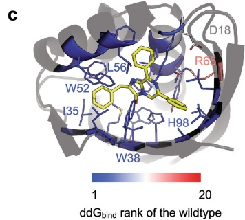

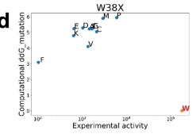

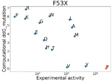

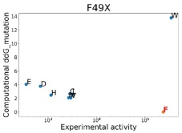

e

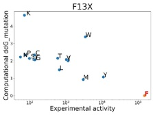

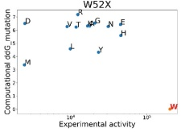

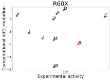

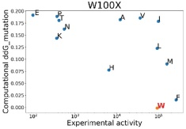

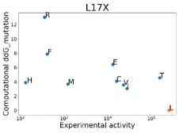

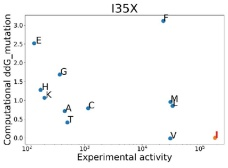

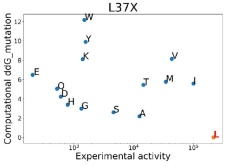

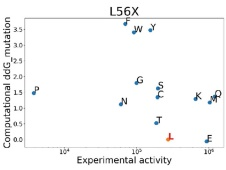

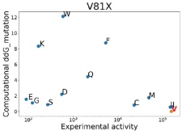

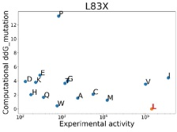

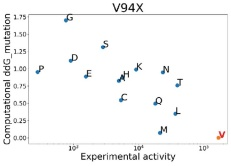

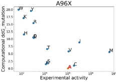

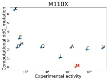

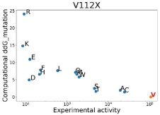

Extended Data Fig. 5 | Predicted changes in substrate-binding free energy from binding-site mutations. The calculated ddG $ _{bind} $ of each mutation was plotted as a function of the relative average experimental luciferase activity. The ddG $ _{bind} $ of hypothetical catalytic residues: a, Tyr14–His98 and b, Asp18–Arg65 dyads were generally not the lowest, which suggested that these designed catalytic residues are not favourable for substrate binding. Red dots

represent the wild-type (LuxSit) amino acids. The rank of wild-type ddG_bind for each position screened for activity is shown with a heat map in c. d–f, The wild-type ddG_bind of the residues designed for d,e, π–π stacking or f, hydrophobic interactions were the lowest compared to the mutation ddG_bind values. This shows that the sequence is near-optimal for substrate binding and the design model is reliable.

