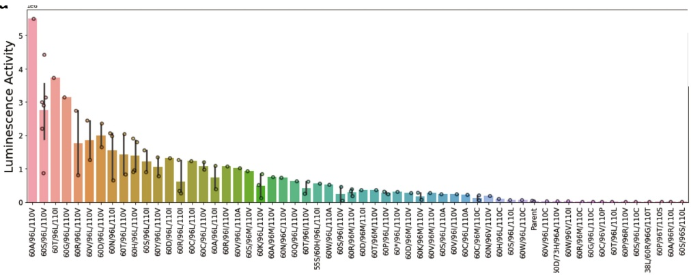
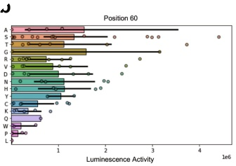
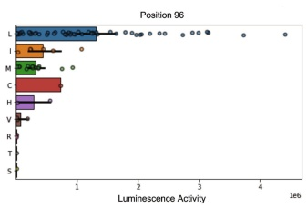
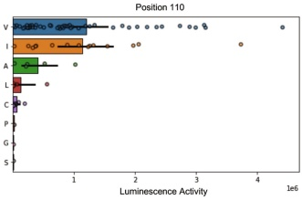

a

b

C

d

<table border=1 style='margin: auto; word-wrap: break-word;'><tr><td style='text-align: center; word-wrap: break-word;'></td><td style='text-align: center; word-wrap: break-word;'>1</td><td style='text-align: center; word-wrap: break-word;'>11</td><td style='text-align: center; word-wrap: break-word;'>21</td><td style='text-align: center; word-wrap: break-word;'>31</td><td style='text-align: center; word-wrap: break-word;'>41</td><td style='text-align: center; word-wrap: break-word;'>51</td></tr><tr><td style='text-align: center; word-wrap: break-word;'>LuxSit</td><td style='text-align: center; word-wrap: break-word;'>MSEEQIRQFL</td><td style='text-align: center; word-wrap: break-word;'>RRFYEALDSG</td><td style='text-align: center; word-wrap: break-word;'>DADTAASLFH</td><td style='text-align: center; word-wrap: break-word;'>PGVTIHLWDG</td><td style='text-align: center; word-wrap: break-word;'>VTFTSREEFR</td><td style='text-align: center; word-wrap: break-word;'>EWFERLFSTR</td></tr><tr><td style='text-align: center; word-wrap: break-word;'>LuxSit-i</td><td style='text-align: center; word-wrap: break-word;'>MSEEQIRQFL</td><td style='text-align: center; word-wrap: break-word;'>RRFYEALDSG</td><td style='text-align: center; word-wrap: break-word;'>DADTAASLFH</td><td style='text-align: center; word-wrap: break-word;'>PGVTIHLWDG</td><td style='text-align: center; word-wrap: break-word;'>VTFTSREEFR</td><td style='text-align: center; word-wrap: break-word;'>EWFERLFSTR</td></tr><tr><td style='text-align: center; word-wrap: break-word;'>LuxSit-f</td><td style='text-align: center; word-wrap: break-word;'>MSEEQIRQFL</td><td style='text-align: center; word-wrap: break-word;'>RRFYEALDSG</td><td style='text-align: center; word-wrap: break-word;'>DADTAASLFH</td><td style='text-align: center; word-wrap: break-word;'>PGVTIHLWDG</td><td style='text-align: center; word-wrap: break-word;'>VTFTSREEFR</td><td style='text-align: center; word-wrap: break-word;'>EWFERLFSTR</td></tr><tr><td style='text-align: center; word-wrap: break-word;'></td><td style='text-align: center; word-wrap: break-word;'>61</td><td style='text-align: center; word-wrap: break-word;'>71</td><td style='text-align: center; word-wrap: break-word;'>81</td><td style='text-align: center; word-wrap: break-word;'>91</td><td style='text-align: center; word-wrap: break-word;'>101</td><td style='text-align: center; word-wrap: break-word;'>111</td></tr><tr><td style='text-align: center; word-wrap: break-word;'>LuxSit</td><td style='text-align: center; word-wrap: break-word;'>KDAQREIKSL</td><td style='text-align: center; word-wrap: break-word;'>EVRGDTVEVH</td><td style='text-align: center; word-wrap: break-word;'>VQLHATHNGQ</td><td style='text-align: center; word-wrap: break-word;'>KHTVDATHHW</td><td style='text-align: center; word-wrap: break-word;'>HFRGNRVTEM</td><td style='text-align: center; word-wrap: break-word;'>RVHINPTG</td></tr><tr><td style='text-align: center; word-wrap: break-word;'>LuxSit-i</td><td style='text-align: center; word-wrap: break-word;'>KDAQREIKSL</td><td style='text-align: center; word-wrap: break-word;'>EVRGDTVEVH</td><td style='text-align: center; word-wrap: break-word;'>VQLHATHNGQ</td><td style='text-align: center; word-wrap: break-word;'>KHTVDATHHW</td><td style='text-align: center; word-wrap: break-word;'>HFRGNRVTEM</td><td style='text-align: center; word-wrap: break-word;'>RVHINPTG</td></tr><tr><td style='text-align: center; word-wrap: break-word;'>LuxSit-f</td><td style='text-align: center; word-wrap: break-word;'>KDAQREIKSL</td><td style='text-align: center; word-wrap: break-word;'>EVRGDTVEVH</td><td style='text-align: center; word-wrap: break-word;'>VQLHATHNGQ</td><td style='text-align: center; word-wrap: break-word;'>KHTVDATHHW</td><td style='text-align: center; word-wrap: break-word;'>HFRGNRVTEM</td><td style='text-align: center; word-wrap: break-word;'>RVHINPTG</td></tr></table>

Extended Data Fig. 6 | Screening of a randomized NNK library at 60, 96 and 110 positions and sequence alignment between LuxSit and its variants. We generated a fully randomized library at 60, 96, and 110 positions to screen all possible combinations exhaustively. After the colony-based screening, we identified many colonies with strong luciferase activities with DTZ. Each colony was expressed individually in each well of 96-well plates (1 mL culture) and purified accordingly (see Supplementary Methods). a, Individual luminescence activity of each selected mutant was plotted and compared to the parent, LuxSit. Luminescence activities were measured in the presence of 25  $ \mu $M DTZ. Luminescence activity (RLU) was shown as the integrated signal over the first 15 min. Statistical analysis of the amino acid frequency versus the luciferase activity at residue b, 60, c, 96, and d, 110. Data are presented as mean ± s.d. (n varies across each bar as the mutants were selected from a randomized library). Arg60 is confirmed to be mutable among all selected mutants as Arg60 may be structurally less well-defined because it emanates from a loop and has no hydrogen-bonding partner. Ala96 prefers larger side-chain substitutions (Leu, Ile, Met, and Cys), and Met110 favours hydrophobic residues (Val, Ile, and Ala). A newly discovered variant (R60S/A96L/M110V) with more than 100-fold higher photon flux over LuxSit was assigned LuxSit-for its high brightness. In the sequence alignment, mutations are highlighted in yellow fonts and grey backgrounds. The conserved catalytic dyads of Asp18-Arg65 and Tyr14-His98 are in green and blue fonts.

