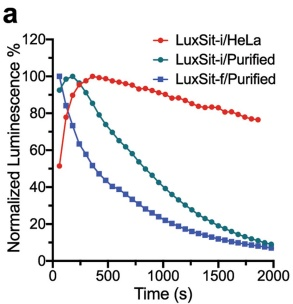
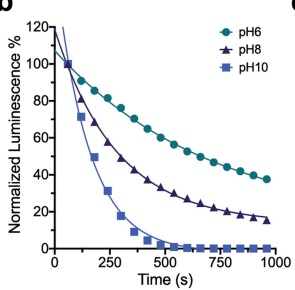
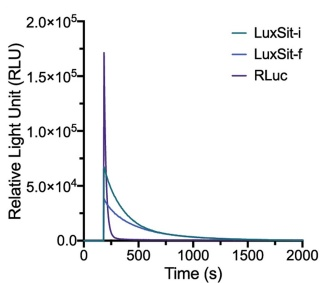

b

Extended Data Fig. 7 | Additional characterization of LuxSit variants. a, Normalized emission kinetics of 15,000 intact HeLa cells expressing LuxSit-i (red), 100 nM purified LuxSit-i (green), or 100 nM purified LuxSit-f (blue) in the presence of 50 μM DTZ. The more extended emission kinetics in HeLa cells is likely due to the diffusion rate of DTZ across cell membranes. b, Normalized luminescence decay curves of LuxSit-i in various pH buffers revealed a

C

pH-dependent catalytic mechanism. c, Luminescent quantum yield was estimated from the integrated luminescence signal until completely converting 125 pmol substrates to photons in the presence of 50 nM corresponding luciferase (see Supplementary Methods). Data are presented as mean (n = 3).

