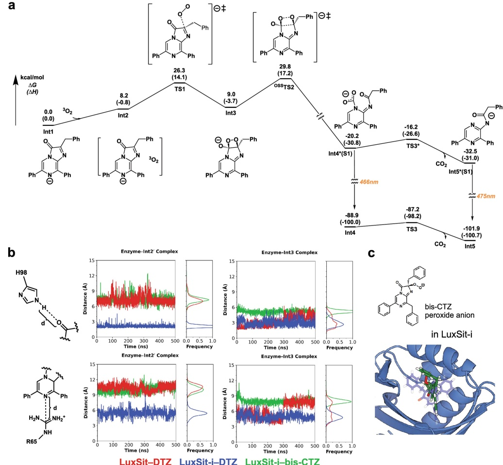

a

Extended Data Fig. 8 | Free-energy profile of DTZ chemiluminescence and MD simulations of proposed protein-intermediate complexes. a, The free-energy profile calculated by density functional theory (DFT) shows triplet oxygen can react directly with the anionic species of DTZ (Int1) through the reactant complex Int2 and TSI. The dioxetane intermediate Int3 then cleaves in an open shell singlet transition state  $ ^{055} $TS2 to form excited intermediate Int4, which rapidly extrudes  $ CO_{2} $ and forms the emissive product Int5. Note: either Int4* or Int5* emit in the observed region, but the lifetime of Int4* is very short and likely completely converts to Int5* before emission. b, Int2 and Int3 were docked into both LuxSit and LuxSit-i and the binding were evaluated by molecular dynamics (MD). The distances between His98 to O1 (top row) and Arg6 to N1 (bottom row) of the substrate were plotted throughout 500 ns MD

simulations. LuxSit-i (blue trace) binds Int2' (middle) considerably better than LuxSit does (red trace), suggesting that the mutations of LuxSit-i provide a binding pocket more complementary to TSL. This binding orientation brings N1 of the substrate much closer to Arg65, providing better charge stabilization for the high energy transition state. c, Docking of the peroxide anion form of bis-CTZ into the pocket of LuxSit-i; blue overlay represents DTZ in the original design model. During MD simulation, the added benzylic carbon of bis-CTZ (green trace) disrupts the shape complementarity between LuxSit-i and the transition states (TS1 and TS2), reducing the charge stabilization by Arg65. This charge stabilization is necessary for the reaction to proceed, explaining the high substrate specificity of LuxSit-i for DTZ over bis-CTZ.

