
a

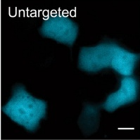

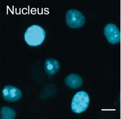

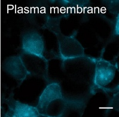

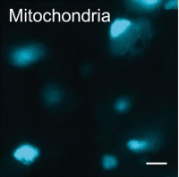

b

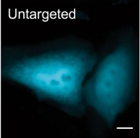

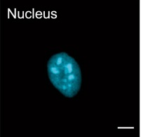

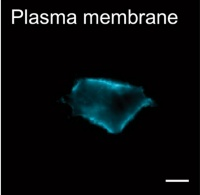

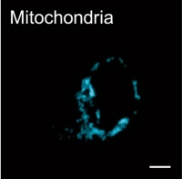

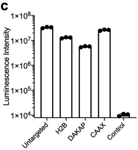

d

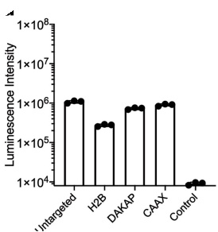

e

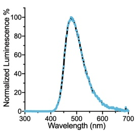

f

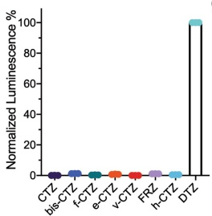

g

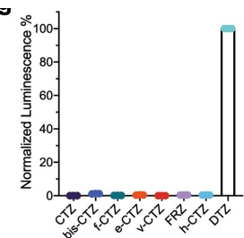

h

Extended Data Fig. 9 | Expression, localization and luminescence activity of LuxSit-i in live HEK293T and HeLa cells. a,b, Fluorescence imaging of live a, HEK293T and b, HeLa cells expressing LuxSit-i-mTagBFP2, which is untargeted or localized to the nucleus (Histone2B), plasma membrane (KRasCAAX), or mitochondria (DAKAP) cellular compartments. Scale bar: 10 µm. c,d, Luminescence signals were measured with 15,000 intact c, HEK293T or d, HeLa cells in the presence of 25 µM DTZ in DPBS. Transfection efficiencies range from 60-70% for HEK293T cells and 5-10% for HeLa cells. e, Luminescence emission spectra acquired from LuxSit-i expressing HEK293T cells is consistent with the

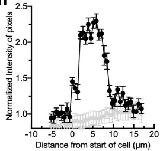

emission spectra of recombinant LuxSit-i purified from E. coli. f,g, Luminescence signals were measured with 15,000 f, intact LuxSit-i expressing HEK293T cells or g, cell lysate in the presence of 25 μM indicated substrate in DPBS. Luminescence intensities were normalized to DTZ signal, showing high DTZ specificity over other substrates in cell-based assays. Data were shown as total luminescence signal over the first 20 min ± s.d. (n = 3). h, Normalized luminescence intensity profile of lines traversing across different cells (n = 10) of main Fig. 3c luminescence image; grey lines represent untransfected cells. Error bars represent ± SEM.

