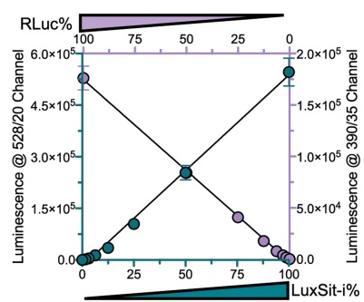
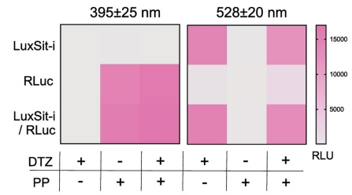
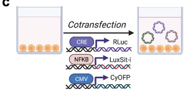
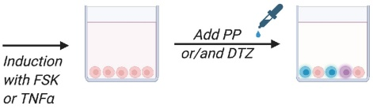
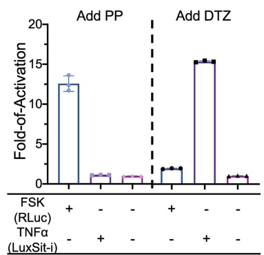
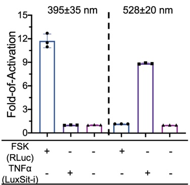

a

b

C

d

Extended Data Fig. 10 | Substrate specificity of LuxSit-i and spectrally resolved luciferase-luciferin pairs allow multiplexed bioassay. a, The orthogonality relationship between LuxSit-i-DTZ and RLuc-PP-CTZ (Prolume Purple, methoxy e-Coelenterazine) luminescent pairs. Indicated percentages of each luciferase were mixed at different ratios totalling 100%. After the addition of both 25 μM DTZ and PP-CTZ substrates, filtered light from 528/20 and 390/35 channels were measured simultaneously. b, Heat map shows the luminescence signal for individual luciferase (100 nM) or 1:1 mixture in the presence of the cognate or non-cognate (DTZ or PP-CTZ or both) substrates. Response signals were acquired by a Neo2 plate reader with 528/20 and

e

390/35 nm filters simultaneously. c, Multiplex luciferase assay in live HEK293T after co-transfection of CRE-RLuc, NF $ \kappa $B-LuxSit-i, and CMV-CyOFP plasmids and stimulation by Forskolin (FSK) or human TNF. d,e, 15,000 intact cells were assayed (see Supplementary Methods) by either d, substrate-resolved or e, spectrally resolved modes after adding DTZ, PP-CTZ, or both DTZ and PP-CTZ in DPBS without cell lysis. Area scanning of the CyOFP fluorescence signal was used to estimate cell numbers and transfection efficiency. The reported unit was RLU/a.u.; relative light units/fluorescence intensity measurements at Ex./Em. = 480/580 nm. All data were normalized to the corresponding non-stimulated control. Data are presented as mean ± s.d. (n = 3).

