
a

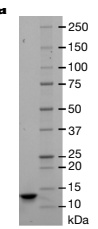

b

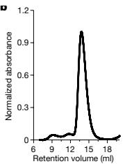

c

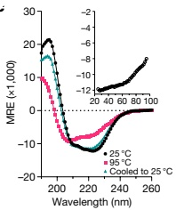

d

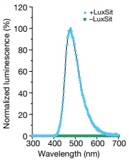

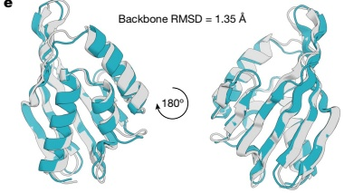

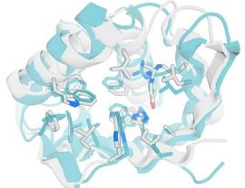

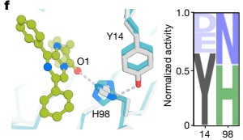

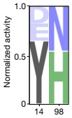

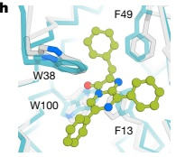

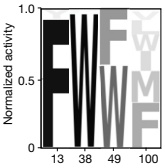

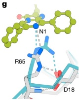

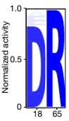

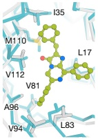

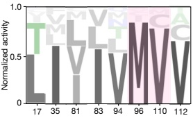

Fig. 2 | Biophysical characterization of LuxSit. a, Coomassie-stained SDS-PAGE of purified recombinant LuxSit from E. coli (for gel source data, see Supplementary Fig. 1). b, Size-exclusion chromatography of purified LuxSit suggests monodispersed and monomeric properties. c, Far-ultraviolet CD spectra at 25 °C (black), 95 °C (red) and cooled back to 25 °C (green). Insert, CD melting curve of LuxSit at 220 nm. MRE, molar residue ellipticity. d, Luminescence emission spectra of DTZ in the presence (blue) and absence (green) of LuxSit. e, Structural alignment of the design model (blue) and AlphaFold2-predicted model (grey), which are in close agreement at both the backbone (left) and the

side-chain (right) level. f–i, Site-saturation mutagenesis of substrate-interacting residues. Magnified views (left) of designed (blue) and AlphaFold2 (grey) models at the side-chain level, illustrating the designed enzyme-substrate interactions of Tyr14–His98 core HBNet (f), Asp18–Arg65 dyad (g), π-stacking (h) and hydrophobic packing (i) residues. Sequence profiles (right) are scaled by the activities of different sequence variants: (activity for the indicated amino acid)/(sum of activities over all tested amino acids at the indicated position). A96M and M110V substitutions with increased activity are highlighted in pink.

Arg65 is highly conserved (Fig. 2g), and its dyad partner Asp18 can only be mutated to Glu (which reduces activity), suggesting that the carboxylate–Arg65 hydrogen bond is important for luciferase activity. In the Tyr14–His98 dyad (Fig. 2f), Tyr14 can be substituted with Asp and Glu, and His98 can be replaced with Asn. As all active variants had hydrogen-bond donors and acceptors at these positions, the dyads might help to mediate the electron and proton transfer required for luminescence. Hydrophobic (Fig. 2i) and  $ \pi $-stacking (Fig. 2h) residues at the binding interface tolerate other aromatic or aliphatic substitutions and generally prefer the amino acid in the original design, consistent with model-based affinity predictions of mutational effects (Extended Data Fig. 5). The A96M and M110V mutants (highlighted in pink) increase activity by 16-fold and 19-fold, respectively, over LuxSit (Supplementary Table 1). Optimization guided by these results yielded LuxSit-f (A96M/M110V), with a flash-type emission kinetic, and LuxSit-i (R60S/A96L/M110V), with a photon flux more than 100-fold higher than that of LuxSit (Extended Data Fig. 6). Overall, the active-site-saturation mutagenesis results support the design model, with the Tyr14–His98 and Asp18–Arg65 dyads having key roles in catalysis and the substrate-binding pocket largely conserved.

The most active catalysts, LuxSit-i (Extended Data Fig. 3b,e,h) and LuxSit-f (Extended Data Fig. 3c,f,i), were both expressed solubly in E. coli at high levels and are monomeric (some dimerization was observed at the high protein concentration; Extended Data Fig. 3l) and thermostable (Extended Data Fig. 3j,k). Similar to native luciferases that use CTZ, the apparent Michaelis constants ( $ K_m $) of both LuxSit-i and