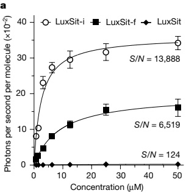
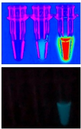
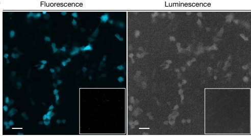

a

b

c

Fig. 3 | Characterization of de novo luciferase activity in vitro and in human cells. a, Substrate concentration dependence of LuxSit, LuxSit-f and LuxSit-i activity. Numbers indicate the signal-to-background (S/N) ratio at Vmax (photons s⁻¹ molecule⁻¹). Data are mean ± s.d. (n = 3). b, Luminescence images acquired by a BioRad Imager (top) or an Apple iPhone 8 camera (bottom). Tubes from left to right: DTZ only; DTZ plus 100 nM purified LuxSit; and DTZ plus 100 nM purified LuxSit-i, showing the high efficiency of photon production. c, Fluorescence and luminescence microscopic images of live HEK293T cells transiently expressing LuxSit-i-mTagBFP2; LuxSit-i activity can be detected at single-cell resolution. Left, fluorescence channel representing the mTagBFP2 signal. Right, total luminescence photons were collected during a course of a 10-s exposure without excitation light, immediately after adding 25 μM DTZ. Insets, negative control, untransfected cells with DTZ. Scale bars, 20 μm; 40× magnification.

LuxSit-fare in the low-micromolar range (Fig. 3a) and the luminescent signal decays over time owing to fast catalytic turnover (Extended Data Fig. 7a). LuxSit-i is a very efficient enzyme, with a catalytic efficiency ( $ k_{cat}/K_{m} $) of  $ 10^{6} $ M $ ^{-1} $ s $ ^{-1} $. The luminescence signal is readily visible to the naked eye (Fig. 3b), and the photon flux (photons per second) is 38% greater than that of the native Renilla reniformis luciferase (RLuc) (Supplementary Table 2). The DTZ luminescent reaction catalysed by LuxSit-i is pH-dependent (Extended Data Fig. 7b), consistent with the proposed mechanism. We used a combination of density functional theory (DFT) calculations and molecular dynamics (MD) simulations to investigate the basis for LuxSit activity in more detail; the results support the anion-stabilization mechanism (Extended Data Fig. 8a and Supplementary Fig. 3a) and suggest that LuxSit-i provides better DTZ transition-state charge stabilization than LuxSit (Extended Data Fig. 8b).

### Cell imaging and multiplexed bioassay

As luciferases are commonly used genetic tags and reporters for cell biological studies, we evaluated the expression and function of LuxSit-i in live mammalian cells. HEK293T cells expressing LuxSit-i-mTagBFP2 showed DTZ-specific luminescence (Fig. 3c), which was maintained after targeting of LuxSit-i-mTagBFP2 to the nucleus, membrane and mitochondria (Extended Data Fig. 9). Native and previously engineered luciferases are quite promiscuous, with activity on many luciferin substrates (Fig. 4a and Supplementary Fig. 4); this is possibly a result of their large and open pockets (a luciferase with high specificity to one luciferin substrate has been difficult to control even with extensive directed evolution $ ^{33,34} $). By contrast, LuxSit-i exhibited exquisite specificity for its target luciferin, with 50-fold selectivity for DTZ over bis-CTZ (which differs only in one benzylic carbon; MD simulations suggest that this arises from greater transition-state shape complementarity (Extended Data Fig. 8b,c and Supplementary Fig. 3b,c)), 28-fold selectivity over 8pyDTZ (differing only in one nitrogen atom) and more than 100-fold selectivity over other luciferin substrates (Fig. 4b). One of our active design for h-CTZ (HTZ3-G4) was also highly specific for its target substrate (Fig. 4c and Extended Data Fig. 4d). Overall, the specificity of our designed luciferases is much greater than that of native luciferases $ ^{35,36} $ or previously engineered luciferases $ ^{37} $ (Supplementary Table 5).

We reasoned that the high substrate specificity of LuxSit-i could allow the multiplexing of luminescent reporters through substrate-specific or spectrally resolved luminescent signals (Fig. 4d and Extended Data Fig. 10a,b). To investigate this possibility, we placed LuxSit-i downstream of the NF-κB response element and RLuc downstream of the cAMP response element (Fig. 4e). The addition of activators (TNF) of the NF-κB signaling pathway resulted in luminescence when cells were incubated with DTZ, while the luminescence of PP-CTZ (the substrate of RLuc) was observed only when the cAMP-PKA pathway was activated (Fig. 4f). Because DTZ and PP-CTZ emit luminescence at different wavelengths, they can in principle be combined and the two signals can be deconvoluted through spectral analysis. Indeed, we observed that activating the NF-κB signaling resulted in luminescence at the DTZ wavelength, while the addition of cAMP-PKA pathway activators (FSK) generated luminescence at the PP-CTZ wavelength, allowing us to simultaneously assess the activation of the two signaling pathways in the same sample with either cell lysates (Fig. 4g) or intact HEK293T cells (Extended Data Fig. 10c–e) by providing both substrates together. Thus, the high substrate specificity of LuxSit-i enables multiplexed reporting of diverse cellular responses.

## Conclusion

Computational enzyme design has been constrained by the number of available scaffolds, which limits the extent to which catalytic configurations and enzyme-substrate shape complementarity can be achieved $ ^{14-16} $. The use of deep learning to produce large numbers of de-novo-designed scaffolds here eliminates this restriction, and the more accurate RoseTTAfold (ref. $ ^{38} $) and AlphaFold2 (ref. $ ^{31} $) should enable protein scaffolds to be generated even more effectively through family-wide hallucination and other approaches $ ^{18,39} $. The diversity of shapes and sizes of scaffold pockets enabled us to consider a range of catalytic geometries and to maximize reaction intermediate-enzyme shape complementarity; to our knowledge, no native luciferases have folds similar to LuxSit, and the enzyme has high specificity for a fully synthetic luciferin substrate that does not exist in nature. With the incorporation of three substitutions that provide a more complementary pocket to stabilize the transition state, LuxSit-i has higher activity than any previous de-novo-designed enzyme, with a  $ k_{cat}/K_{m} $ ( $ 10^{6} $ M $ ^{-1} $ s $ ^{-1} $) in the range of native luciferases. This is a notable advance for computational enzyme design, as tens of rounds of directed evolution were required to obtain catalytic efficiencies in this range for a designed retroaldolase, and the structure was remodelled considerably $ ^{40} $; by contrast, the predicted differences in ligand-side-chain interactions between LuxSit and LuxSit-i are very subtle (Supplementary Fig. 2b; achieving such high activities directly from the computer remains a