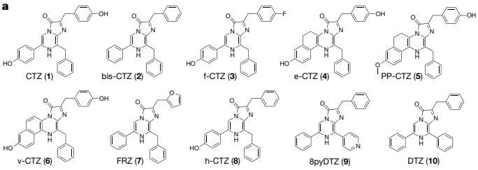
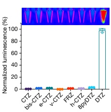
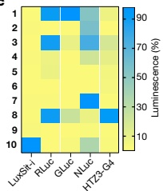
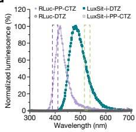
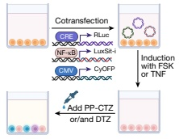
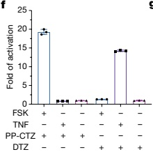
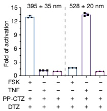

a

b

e

f

g

Fig. 4 | High substrate specificity of de novo luciferases allows multiplexed bioassay. a, Chemical structures of coelenterazine substrate analogues.

b, Normalized activity of LuxSit-i on selected luciferin substrates. Luminescence image (top) and signal quantification (bottom) of the indicated substrate in the presence of 100 nM LuxSit-i. LuxSit-i has high specificity for the design target substrate, DTZ. c, Heat map visualization of the substrate specificity of LuxSit-i; Renilla luciferase (RLuc); Gaussia luciferase (GLuc); engineered NLuc from Oplophorus luciferase; and the de novo luciferase (HTZ3-G4) designed for h-CTZ. The heat map shows the luminescence for each enzyme on each substrate; values are normalized on a per-enzyme basis to the highest signal for that enzyme over all substrates. d, The luminescence emission spectrum of LuxSit-i-DTZ (green) and RLuc-PP-CTZ (purple) can be spectrally resolved by 528/20 and 390/35 filters (shown in dashed bars) and only recognize the cognate substrate. e, Schematic of the multiplex luciferase assay. HEK293T cells

transiently transfected with CRE-RLuc, NF-κB-LuxSit-i and CMV-CyOFP plasmids were treated with either forskolin (FSK) or human tumour necrosis factor (TNF) to induce the expression of labelled luciferases. f,g, Luminescence signals from cells can be measured under either substrate-resolved or spectrally resolved methods by a plate reader. f, For the substrate-resolved method, luminescence intensity was recorded without a filter after adding either PP-CTZ or DTZ. g, For the spectrally resolved method, both PP-CTZ and DTZ were added, and the signals were acquired using 528/20 and 390/35 filters simultaneously. In f and g, the bottom panel indicates the addition of FSK or TNF. Luminescence signals were acquired from the lysate of 15,000 cells in CellLytic M reagent, and the CyOFP fluorescence signal was used to normalize cell numbers and transfection efficiencies. All data were normalized to the corresponding non-stimulated control. Data are mean ± s.d. (n = 3).

challenge in computational enzyme design). The small size, stability and robust folding of LuxSit-i makes it well-suited in luciferase fusions to proteins of interest and as a genetic tag for capacity-limited viral vectors. On the basic science side, the small size, simplicity and high activity of LuxSit-i make it an excellent model system for computational and experimental studies of luciferase catalytic mechanism. Extending the approach used here to create similarly specific luciferases for synthetic luciferin substrates beyond DTZ and h-CTZ would considerably extend the multiplexing opportunities illustrated in Fig. 4 (particularly with the recent advances in microscopy $ ^{41} $), and enable a new generation of multiplexed luminescent toolkits. More generally, our family-wide hallucination method opens up an almost unlimited number of scaffold possibilities for substrate binding and catalytic residue placement, which is particularly important when the reaction mechanism and how to promote it are not completely understood: many alternative structural and catalytic hypotheses can be readily enumerated with shape and chemically complementary binding pockets but different catalytic residue placements. Although luciferases are unique in catalysing the emission of light, the chemical transformation of substrates into products is common to all enzymes, and the approach developed here should be readily applicable to a wide variety of chemical reactions.

#### Online content

Any methods, additional references, Nature Portfolio reporting summaries, source data, extended data, supplementary information, acknowledgements, peer review information; details of author contributions and competing interests; and statements of data and code availability are available at https://doi.org/10.1038/s41586-023-05696-3.