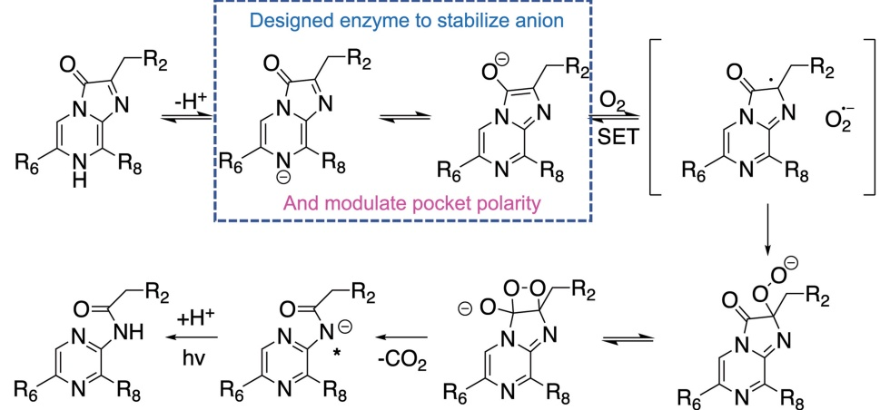

## Article

Extended Data Fig. 1 | Proposed catalytic mechanism of coelenterazine-utilizing luciferases. Density functional theory (DFT) calculation suggested that the formation of an anionic state is the essential electron source for the activation of triplet oxygen (³O₂). Supported by both theoretical²⁵,²⁶ and experimental evidence²⁷,²⁸, the next oxygenation process is likely through a single-electron transfer (SET) mechanism in which the surrounding reaction field could highly influence the change of Gibbs free energy (ΔG_SET). Finally, the thermolysis of a dioxetane light emitter intermediate can produce photons via the mechanism of gradually reversible charge-transfer-induced luminescence.

(GRCTIL), which is generally exergonic. As all the historical pieces of evidence are based on calculations in the virtual solvents or chemiluminescence in ideal organic solvents, the detailed mechanism of a luciferase-catalysed luminescence reaction has remained unclear. We proposed that the key step of the enzyme is to promote the formation of an anionic state and create a suitable environment to facilitate efficient SET. Hence, the goal of this study is to design an enzyme reaction field surrounding the substrate to stabilize the anionic substrate state and alter the local proton activity, solvent polarity, and hydrophobicity for the efficient activation of  $ {}^{3}O_{2} $.

