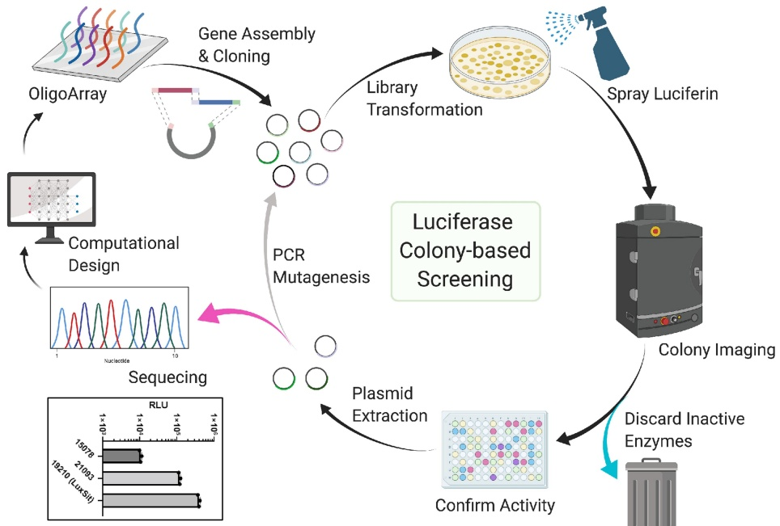

Extended Data Fig. 2 | Schematic representation of colony-based luciferase screening. Computationally designed DNA sequences were purchased in an oligo array, where the fragments were amplified by PCR, assembled, and ligated into a pBAD bacterial expression vector. The plasmid library was used to transform DH10B cells. Each colony grown on the LB agar plate represented one luciferase design. The plates were sprayed with DTZ solution and imaged to identify active colonies using a ChemiDoc imager. Selected colonies were inoculated in 96-well plates, expressed, and purified to confirm individual luciferase activity. Plasmids can then be individually sequenced to point out active design models that provide insights into the design principle and enzyme functions or can be subjected to random mutagenesis for further evolution. Insert: three luciferases were identified from this screening. We refer to the most active and DTZ-specific luciferase as "LuxSit".

